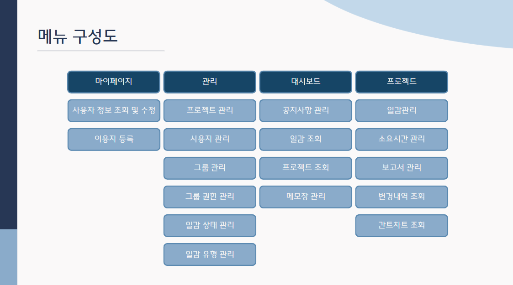
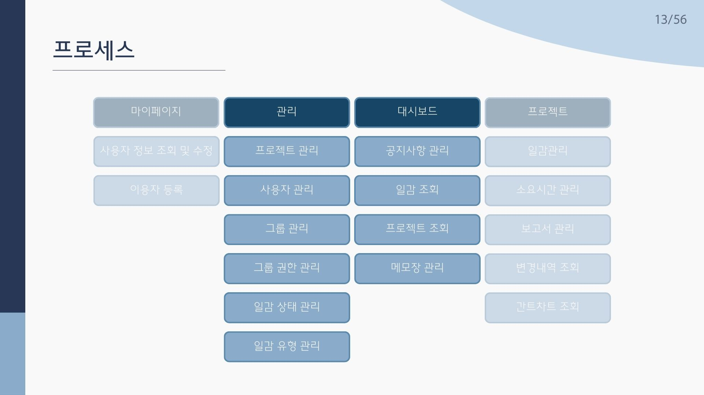
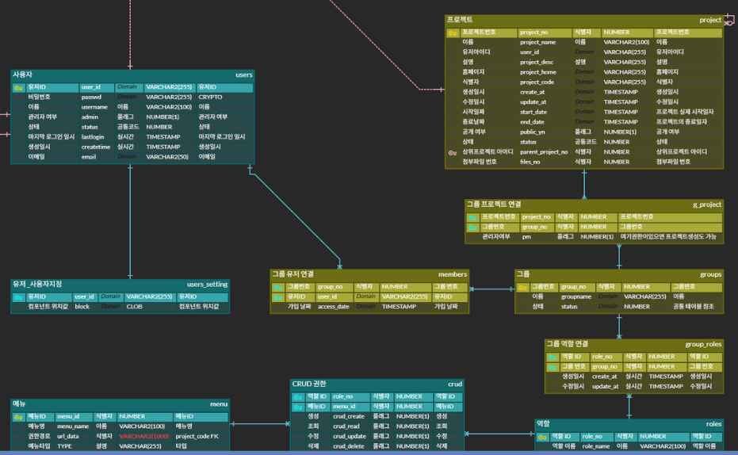
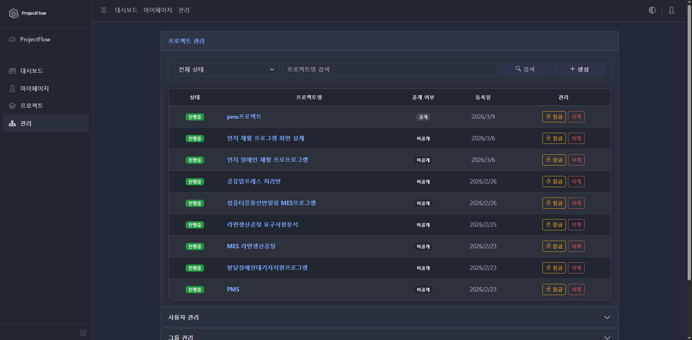
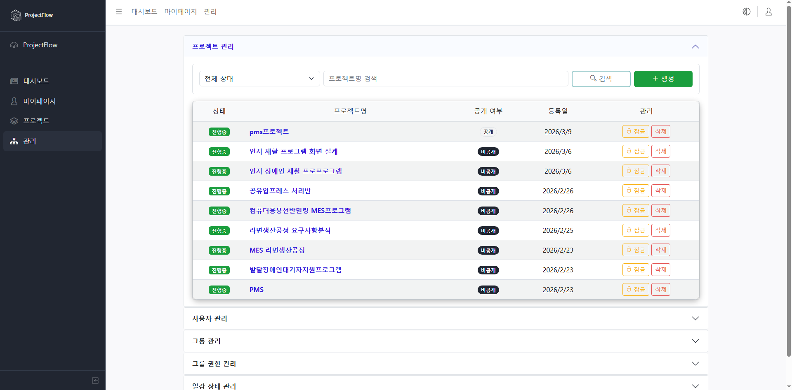

# 4강 1조 프로젝트 관리 툴

## 📋 프로젝트 개요

- 조직 맞춤형 프로젝트/사용자/그룹/권한/일감 설정을 통합 관리할 수 있는

- 독립형 프로젝트 관리 툴을 직접 구축하고자 하였습니다.

- 이를 통해 조직 맞춤형 업무 프로세스의 정립과, 관리자의 운영 효율이 향상되는 기대효과가 예상됩니다.

---

## 🛠️ 개발환경

| 구분 | 기술 |
|------|----------|
| 분석・설계 | Figma, ERD Cloud, Google Workspace |
| 통합 개발 환경 | Eclipse |
| 형상 관리 툴 | GitHub |
| 데이터 베이스 | Oracle |
| 인프라・서버 | AWS, ubuntu |
| 빌드・배포 | Jenkins, Docker |
| 프론트엔드 | HTML, CSS, JavaScript, Thymeleaf, CoreUI, DHTMLX |
| 백엔드 | Spring Boot, Java, Mybatis, JPA |

---

## 📊 데이터 베이스 설계

> 총 테이블：22개
---

## 🗺️ 사이트 구성도

---

## 👥 프로젝트 팀 구성 및 역할

| 멤버     | 담당내용 |
|----------|----------|
| 배진욱 | 팀장, 프로젝트 배포, 대시보드, 통합 관리 페이지 |
| 김현태 | 부팀장, 개발환경 구축, 프로젝트 관리, 간트차트 |
| 송승일 | DB서버 구축, 보안, 공용API, 로그인, 회원가입, 마이페이지 |
| 김동우 | GitHub 관리, 일감, 소요시간, 보고서 |

---

## 🎬 시연영상

**유튜브 링크:** [프로젝트시연영상](https://youtu.be/LfKW6Law_SE)

### 개발 일정
- **2026.01.29 ~ 2024.3.12**

### 메인 링크
- 🔗 https://github.com/itomato1369/YEDAM-3st-Project

### 기대 효과
- 조직 맞춤형 업무 프로세스 정립
- 관리자 운영 효율 향상
-본 프로젝트는 사용자, 프로젝트, 그룹, 권한 등을 통합 관리할 수 있도록 설계된 구조로 향후 다양한 기능 확장이 가능하도록 구현되었습니다.

---

##  담당 프로세스 흐름도

  

---

  <a href="#프로젝트-개요"><kbd>📘 프로젝트 개요</kbd></a>
  &nbsp;&nbsp;
  <a href="#내-파트"><kbd>🧩 담당 파트</kbd></a>
  &nbsp;&nbsp;
  <a href="#프로젝트-소감"><kbd>📝 프로젝트 소감</kbd></a>

---

### 담당 파트 데이터베이스

<!-- 내 파트 관련 DB 이미지 -->

그룹 중심의 권한 관리 설계

---

### 내 파트 페이지별 기능
<a id="settings">통합 관리 페이지</a>
# 시스템 관리 파트
기존 Redmine의 시스템 관리 방식은 사용자에게 역할(Role)을 직접 부여하거나 프로젝트 단위로 권한을 설정하는 구조입니다. 이 방식은 유연성은 있으나, 사용자 수가 증가할수록 권한 관리의 복잡도가 높아지는 한계가 있습니다.

이를 그룹 중심의 권한 부여 방식으로 이행할 경우, 사용자 개별이 아닌 그룹 단위로 권한을 관리할 수 있어 관리 효율성을 크게 향상시킬 수 있습니다. 관리자는 특정 그룹에 역할과 권한을 미리 정의하고, 사용자를 해당 그룹에 소속시키는 것만으로 권한을 일괄 적용할 수 있습니다.

또한 조직 구조(부서, 팀 등)를 반영한 권한 관리가 가능해지며, 프로젝트별 권한 설정을 반복할 필요 없이 그룹 기반으로 일관된 접근 제어를 유지할 수 있습니다. 이는 특히 대규모 조직 환경에서 권한 관리의 유지보수성과 확장성을 크게 개선하는 방식입니다.

#### 기능 1. 통합 관리 페이지 / (시스템 통합 관리)

<!-- 화면 이미지 -->

- 다크모드 레이아웃 적용가능
- 프로젝트, 사용자, 그룹, 그룹 권한, 일감 상태, 일감 유형의 CRUD 가능
- 접근 가능 권한 : 시스템 관리자
- 벤치마킹한 redmine과 달리 아코디언 형식의 전체관리를 하나의 페이지에서 가능

---

